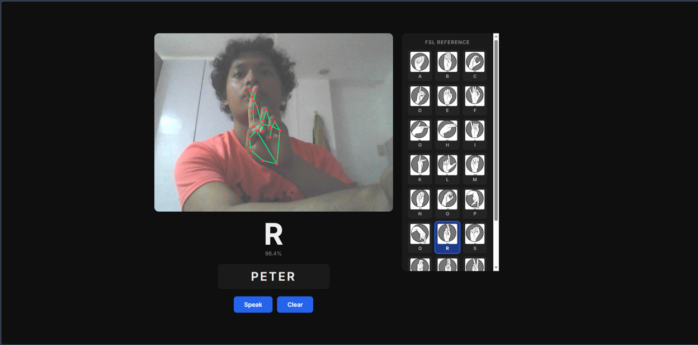

# FSL Classifier

A real-time Filipino Sign Language (FSL) fingerspelling classifier that runs entirely in the browser — no installation, no backend, no cost.

**[Live Demo →](https://fsl-classifier.vercel.app/)**



---

## What it does

Show your hand to the camera and sign any of the 24 supported FSL static letters. The app recognizes your hand sign in real time, builds a word as you spell it out, and reads the word aloud on demand.

- **Real-time recognition** — MediaPipe Hands extracts 21 hand landmarks per frame, a custom-trained neural network classifies the hand shape
- **Word builder** — hold a sign steady for 1.5 seconds to append the letter to your word
- **NG detection** — signing N followed by G produces NG as a single unit
- **Text-to-speech** — press Speak to hear the built word read aloud via the Web Speech API
- **FSL reference sidebar** — all 24 supported letter handshapes visible while signing

---

## Supported letters

24 static FSL letters: A B C D E F G H I K L M N O P Q R S T U V W X Y

J, Z, and Ñ require motion/trajectory and are not supported in v1.0.
NG is handled via word builder logic — it is not a model class.

---

## Tech stack

| Layer | Tools |
|---|---|
| Hand landmark extraction | MediaPipe Hands (JavaScript, CDN) |
| Browser inference | TensorFlow.js (CDN) |
| Text-to-speech | Web Speech API (built into browser) |
| Model training | Python, TensorFlow/Keras |
| Data collection | Python, MediaPipe Tasks API, OpenCV |
| Hosting | Vercel (static site) |
| Fonts | Google Fonts — Inter |

---

## ML pipeline

1. **Data collection** — `collect_data.py` captures 21 hand landmarks per frame via MediaPipe and saves them as CSV rows (63 values + label)
2. **Preprocessing** — wrist normalization (subtract landmark 0 x/y) then scale normalization (divide by max absolute value per sample)
3. **Training** — dense neural network trained in Keras: Input(63) → Dense(128, ReLU) → Dropout(0.3) → Dense(64, ReLU) → Dropout(0.3) → Dense(24, Softmax)
4. **Export** — model weights manually exported to TF.js format (model.json + binary weights)
5. **Inference** — same normalization pipeline runs in JavaScript every frame, model.predict() called on a [1, 63] tensor

### Dataset
- 9,600 samples total — 400 per letter × 24 letters
- Single signer (developer's hand)
- Collected under varied lighting, distances, and angles

### Model
- Architecture: 3 Dense layers, 18,008 parameters
- Validation accuracy: 100% on developer's hand data
- Input: 63 landmark coordinates (normalized)
- Output: 24 class probabilities

---

## Project structure
```
fsl-classifier/
├── data/
│   └── dataset.csv              # 9,600 rows, 64 columns
├── notebook/
│   ├── train_model.ipynb        # Full training notebook
│   ├── training_curves.png
│   └── confusion_matrix.png
├── tfjs_model/                  # Exported TF.js model (root copy)
├── web/                         # Deployed browser app
│   ├── index.html
│   ├── style.css
│   ├── classifier.js            # TF.js model loading + inference
│   ├── wordBuilder.js           # Hold detection, word logic, TTS
│   ├── hands.js                 # MediaPipe setup, webcam pipeline
│   ├── label_map.json
│   ├── fsl_images/              # 24 FSL letter reference images
│   └── tfjs_model/              # Model files served by Vercel
├── collect_data.py              # Data collection script
├── hand_landmarker.task         # MediaPipe model file
├── label_map.json
└── requirements.txt
```

---

## Running locally

The browser app requires no setup — just open `web/index.html` via a local server.

Using VS Code Live Server extension:
1. Open the `web/` folder in VS Code
2. Right-click `index.html` → Open with Live Server
3. Allow camera access when prompted

To retrain the model:
1. Create a Python 3.11 virtual environment
2. `pip install -r requirements.txt`
3. Run `collect_data.py` to collect landmark data
4. Open and run `notebook/train_model.ipynb`

---

## Known limitations

- **Single signer** — trained on one person's hand data, may not generalize well to other hand sizes, skin tones, or signing styles
- **Static signs only** — single-frame input cannot capture motion; J, Z, Ñ are excluded
- **Single hand** — only one hand detected at a time
- **No facial expression input** — FSL grammar uses facial markers which are not captured

These are intentional v1.0 scope decisions. See the roadmap below for planned improvements.

---

## Roadmap

| Version | Focus | Key addition |
|---|---|---|
| v1.0 | FSL fingerspelling (current) | 24 static letters, browser-only |
| v2.0 | Motion-aware signs | LSTM model, both hands, 30-frame sequences |
| v3.0 | FSL word vocabulary | Transformer model, facial landmarks, FastAPI backend |
| v4.0 | Full conversation system | LLM pipeline, avatar output, WebSocket streaming |

---

## Credits

- FSL reference images — [Project Fingeralphabet](https://www.fingeralphabet.org/FSL) by Lassal, licensed under [CC BY-NC-ND 4.0](https://creativecommons.org/licenses/by-nc-nd/4.0/)
- Hand landmark detection — [MediaPipe](https://mediapipe.dev/) by Google
- Browser inference — [TensorFlow.js](https://www.tensorflow.org/js) by Google

---

*A hands-on ML project covering the full pipeline: data → training → deployment*